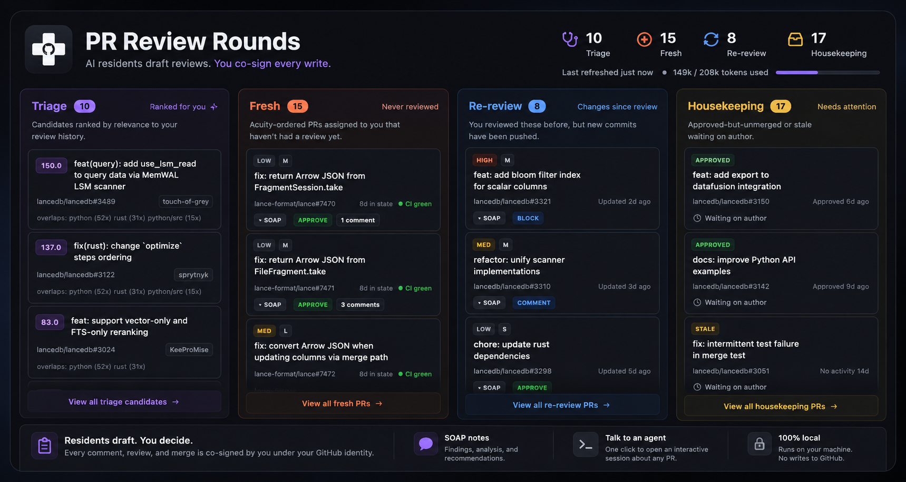

# PR Residents



A local app that assembles your daily PR-review rounds and drafts reviews with an
AI agent — you co-sign every write. It runs entirely on your machine, under your
own GitHub identity, on your Claude subscription.

The model is medical: a nightly **round** triages the PRs waiting on you into three
lanes (fresh / re-review / housekeeping), a **resident** agent writes up each one as
a SOAP note (findings + a recommendation), and you — the **attending** — read the
rounds in the morning and co-sign each comment, review, or merge. The agent never
writes to GitHub. That co-sign, under your identity, is the whole accountability
model.

## What it does

- **Refresh** — pulls the PRs waiting on you across your configured repos, sorts
  them into lanes, and ranks self-requested candidates worth picking up. Pure
  GitHub API calls; fast; no agent involved.
- **Dispatch** — runs resident agents over the PRs that need a deep look, in
  parallel, producing a SOAP review per PR. This is the part that spends tokens.
- **Review** — a web UI shows the three lanes with each SOAP tucked under its PR.
  You read, probe, and co-sign writes yourself.
- **Talk** — one click per PR stages a checkout and hands you a command to open an
  interactive agent session about that PR, with the review notes already in context.

Everything the agent produces is a **draft**. The app makes **zero writes** to
GitHub's review surface — no comments, reviews, labels, or merges. You do those.

## Install

Pure-Go binary, no runtime dependencies. Serves its own web UI on localhost.

```sh
go install github.com/wjones127/pr-residents/cmd/residents@latest
```

Then run the one-time setup and start the server:

```sh
residents init          # interactive setup: repos, tokens, engine → ~/.pr-residents/
residents serve --open  # starts localhost:8787 and opens the browser
```

`residents serve` binds to `127.0.0.1` only. There is no auth and no remote access
by design — it is a single-user local tool.

## Onboarding

PR Residents is **strictly per-user**. It runs under *your* GitHub identity so every
review you co-sign is your own. There is no shared bot account and no shared server;
each teammate installs and runs their own instance.

`residents init` walks you through setup in the terminal (secrets stay in the
terminal, never a browser form) and writes everything to `~/.pr-residents/`:

1. **Repos** — the repos you review.
2. **GitHub username** — your `github_login`.
3. **Interests** — optional path prefixes for cold-start relevance.
4. **Tokens** — one read-only, fine-grained PAT per org (Contents: Read, Pull
   requests: Read, Metadata: Read — nothing writable, so a leaked token can't post or
   merge as you). Each token is **entered masked, validated live** against the API
   (init prints who it authenticated as), then saved to your OS keychain — never to a
   config file. See [Security](#security). Leave a token blank to skip an org and set
   its `GITHUB_TOKEN_<ORG>` env var instead.
5. **Engine** — init checks that an agent CLI is on your PATH. Default is Claude Code
   (`claude`), logged into your Pro/Max subscription — the app shells out to it so
   reviews bill against your subscription, not API pricing. The CLI owns its own auth;
   the app stores nothing here. See [Agent engines](#agent-engines).

`residents init` also materializes the bundled policy files (`escalation.yml`,
`comment-vocab.md`) into `~/.pr-residents/`, and never overwrites them once you've
tuned them.

For cron/headless use, run `residents init` with no TTY (e.g. `echo | residents
init`): it writes a `config.yml` skeleton and skips the prompts, and
`GITHUB_TOKEN_<ORG>` env vars are honored without any keychain entry.

## The workflow

1. Open the web UI (`residents serve --open`).
2. Click **Refresh**. The lanes populate in seconds.
3. Click **Dispatch**. Residents fan out over the PRs needing review; a progress bar
   shows GitHub reads, then per-agent status, a live **token counter**, and a
   **Cancel** button. Cancelling stops new work and discards in-flight partials —
   PRs already reviewed keep their SOAP.
4. Read the rounds. Each PR shows its SOAP: findings tied to lines/tests, drafted
   comments in conventional-comment form, and an approve / block / comment call.
5. **Co-sign.** For each draft you agree with, post the comment / submit the review /
   merge — yourself, under your identity. Probe a resident ("did you check the null
   case?") and it rewrites the disposition rather than just answering.
6. Need a conversation? Click **Talk** on a PR (see below).

Refresh is cheap — run it whenever. Dispatch is the spend; the app caches each SOAP
by the PR's head commit, so re-dispatching only re-reviews PRs that actually changed.

## The three lanes

- **Fresh** — assigned to you, never reviewed. Ordered by acuity (size × CI × risk).
- **Re-review** — you reviewed it, the author pushed since. The resident reconstructs
  the conditions you set last time and checks each against the *actual* new diff, then
  does a fresh-eyes pass over what changed.
- **Housekeeping** — no deep workup. Discharge planning: approved-not-merged and
  stale-waiting-on-author, surfaced so nothing rots.

## Talk to an agent about a PR

The **Talk** button stages an interactive session so you can dig into a PR with the
agent instead of only reading its writeup:

1. The app adds a git worktree with the PR's head checked out.
2. It writes a primer into that worktree — the SOAP notes, a diff summary, and PR
   metadata.
3. It hands you a copyable command:

   ```sh
   cd ~/.pr-residents/worktrees/<repo>-<number> && claude "$(cat .pr-primer.md)"
   ```

Run it in your terminal and you're in a session about that PR with the review
context already loaded. (MVP is the copyable command; deeper in-app integration may
come later.)

## Agent engines

Reviews run through an **agent hook**, not direct API calls — so they use your CLI
subscription rather than metered API pricing. The hook is an interface; Claude Code
is the first implementation.

- **claude** (default) — shells out to headless `claude -p` running the bundled
  review skills. Uses whatever your `claude` CLI is logged into.
- **codex**, **copilot**, others — planned, behind the same interface.

> Note: subscription-vs-API pricing for headless CLI use has shifted before and may
> shift again. The engine hook and the model-routing table below are where we absorb
> that — retune one place, not the whole app.

## Configuration

`~/.pr-residents/config.yml`:

```yaml
github_login: your-handle
repos:
  - lance-format/lance
  - lancedb/lancedb
interests:              # optional; cold-start relevance until history accrues
  - rust/lance-index
  - python bindings

dispatch:
  engine: claude        # claude | codex | copilot(planned)
  concurrency: 6        # parallel resident agents; 4–8 is a sane range
  model_routing:        # match model to lane/size; retune when pricing changes
    default: opus
    fresh_xl: opus       # L/XL core-library PRs get the strongest model
    fresh_xs: haiku      # trailing-comma / version-bump PRs go cheap
    docs_only: haiku
    re_review: sonnet

server:
  port: 8787
```

Secrets are never in this file — tokens live in your OS keychain (or a `0600` file
fallback, or a `GITHUB_TOKEN_<ORG>` env var). See [Security](#security).

## State & privacy

State lives under `~/.pr-residents/` on your disk. Two namespaces:

- **cache/** — GitHub-derived and reconstructible: PR records, the relevance profile,
  a PR-detail SQLite cache, and cached SOAP workups keyed by head commit. Pruned when
  PRs leave your queue.
- **ledger/** — durable and yours alone: your drafted dispositions, kept as a local
  record of each round. Never pruned, never shared.

Your state is personal review history. It stays local and must not be shared.

## Security

The only secret PR Residents stores is your GitHub token — and it's **read-only**, so
its blast radius is bounded by design: a leak can read your PRs but can't post, merge,
or act as you. Your Claude subscription is *not* stored by the app; the `claude` CLI
owns its own auth and we shell out to it.

Tokens are resolved in this order (first hit wins):

1. `GITHUB_TOKEN_<ORG>` environment variable — explicit override for cron/headless;
   never touches disk. (`<ORG>` is the org upper-snake-cased, e.g. `lance-format` →
   `GITHUB_TOKEN_LANCE_FORMAT`.)
2. **OS keychain** — what the wizard writes to by default (macOS Keychain, Linux
   Secret Service, Windows Credential Manager). Encrypted at rest; can't be committed
   by accident.
3. `0600` file fallback — used only when no keychain is available (e.g. headless
   Linux, WSL); owner-only permissions, and the app warns that keychain is preferred.

Secrets never live in `config.yml`, so the config is safe to read, share, or sync.

## Architecture

Single Go binary:

- **pipeline** — deterministic, no agent: fetch PRs (GitHub GraphQL) → derive lanes,
  acuity, blocked-on → rank relevance → render. This is what **Refresh** runs.
- **store** — the `cache/` + `ledger/` seam over local disk (SQLite for the PR-detail
  and workup caches). A seam, so the backend can move to a queryable store later.
- **jobs** — async supervisor for Refresh and Dispatch; emits progress (counts, token
  usage, per-agent state) over Server-Sent Events to the UI.
- **agent** — the `WorkupAgent` seam (batch, structured SOAP out) and the
  `SessionLauncher` seam (interactive "Talk"). Claude Code implements both first.
- **web** — server-rendered lanes (the same view for every frontend) enhanced with
  htmx + SSE for the buttons and live progress. No SPA build step; the binary serves
  everything.

The pipeline is deterministic and owns the correctness traps (commit-identity for
"pushed since I looked", re-review delta anchoring, stale-approval re-surfacing). The
agent only writes SOAP notes. Keeping those apart is what makes Refresh cheap and
Dispatch the only thing that spends tokens.

## Roadmap

- Codex and Copilot engine adapters behind the agent hook.
- In-app agent chat (beyond the copyable Talk command).
- A queryable/vector store backend for the workup cache and relevance.
- Optional shared-server mode (today it is strictly per-user local).
- Reconciliation / learning loop — track how your co-signed reviews compared to the
  drafts, to tune future dispositions. (Deferred; not in the initial app.)

## CLI reference

```
residents init                      interactive setup → ~/.pr-residents/ (repos, tokens, engine)
residents serve [--port] [--open]   run the local web app
residents refresh                   run the pipeline once, headless (for cron)
residents dispatch                  run a round headless (for cron)
```

All commands accept `--config-dir` (default `~/.pr-residents`) and `--state-dir`
(default `<config-dir>/state`).
